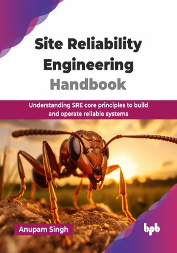

# Site Reliability Engineering Handbook

Understanding SRE core principles to build and operate reliable systems.

This is the repository for [Site Reliability Engineering Handbook
](https://bpbonline.com/products/site-reliability-engineering-handbook?_pos=1&_sid=f683a4ae3&_ss=r&variant=44719109112008?variant=44719109112008),published by BPB Publications.

## About the Book
SRE is a set of principles and practices that apply a software engineer’s approach and help IT operations. The role of the site reliability engineer (SRE) is to bridge the gap between development and operations, ensuring that systems are not only robust but also performant. SRE aims to deliver a highly scalable and reliable software system; however, like any technology and practice, some roadblocks can lead to pitfalls for SRE. 

This book systematically guides you through the SRE landscape, starting with an introduction to its core principles and its synergy with DevOps. It will take readers through some real-world scenarios of SRE pitfalls and solutions. You will learn how to build effective, reliable systems by implementing best practices. The book will also cover technologies and processes such as site reliability engineering methodology and DevOps. It concludes with a practical SRE toolkit, an overview of the SRE role, and a vision for the future of the field, preparing you for success.

By the end of the book, readers will be equipped with the principles and practices needed to design, build, and maintain a truly reliable system at scale, effectively diagnose and resolve issues, and confidently apply these skills to any modern software environment.

## What You Will Learn
• Learn the foundational pillars of SRE.

• Technical distinctions and synergies between SRE and DevOps.

• Identifying system loopholes and solutions to improve its performance.

• Choosing the right metrics to measure system performance and availability. 

• Creating a comprehensive SRE toolkit with industry-standard tools. 

• Roles and responsibilities of an SRE engineer.
